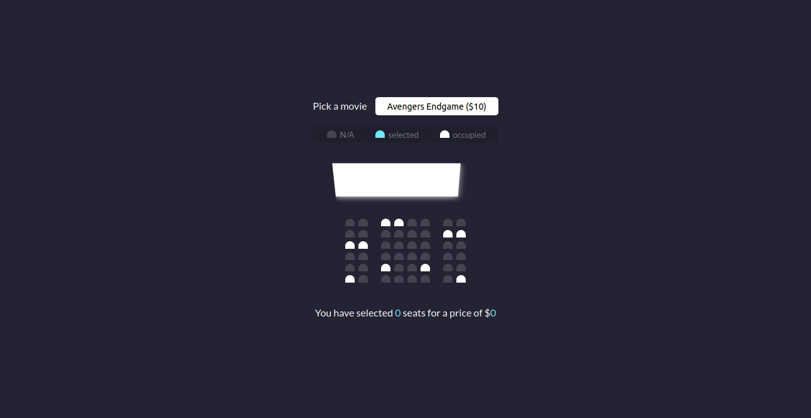

# Movie Seat Booking
This web app is for reserving seat for a movie. It is only frontend and it uses browser local storage to store selected seats.

## Built With

- Html
- CSS
- Javascript

## Screenshot
Project Design Screenshot : 

## Live Demo

[Live Demo Link](https://talhawaqar.github.io/Movie-Seat-Booking/)

## Authors

👤 **Muhammad Talha Waqar**

- Github: [@talhawaqar](https://github.com/talhawaqar)
- Linkedin: [@talha-waqar](https://www.linkedin.com/in/talha-waqar-977257145/)
- Twitter: [@MuhammadTalhaW4](https://twitter.com/MuhammadTalhaW4)
- email: (talhawaqar007@hotmail.com)
- email: (talhawaqar007@gmail.com)

## 🤝 Contributing

Contributions, issues and feature requests are welcome! Start by:

- Forking the project
- Cloning the project to your local machine
- `cd` into the project directory
- Run `git checkout -b your-branch-name`
- Make your contributions
- Push your branch up to your forked repository
- Open a Pull Request with a detailed description to the development branch of the original project for a review

## 📝 License

This project is [MIT](https://opensource.org/licenses/MIT) licensed.
